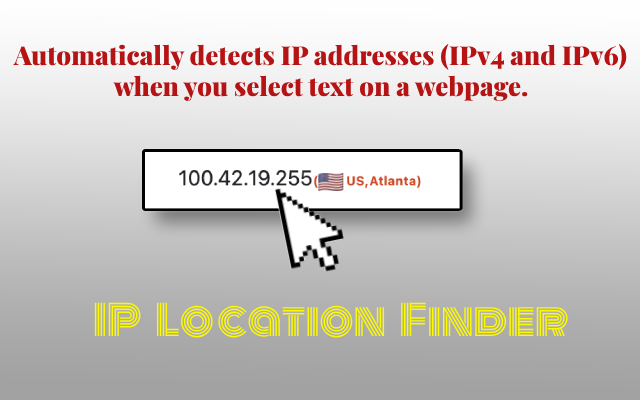
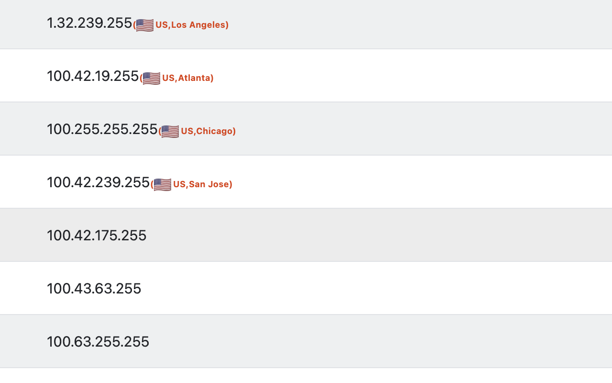

# IP Location Finder

|  | A Chrome extension that identifies the geographic location of IP addresses on a webpage. |
|----------------------------------|-----------------------------|

> **Current Version: 1.5.0** | Manifest V3

## Features

*   **Automatic IP Detection:** Automatically detects IP addresses (IPv4, IPv6, and IPv4 CIDR notation like `192.168.1.0/24`) when you select text on a webpage.
*   **Geographic Location:** Displays the country and city (when available) associated with the selected IP address.
*   **Flag Icon & Country Code:** Displays a flag icon and country code alongside the location information.
*   **ISP/Organization Info:** Shows the ISP or organization name in a tooltip when available from the API response.
*   **API Failover:** Automatically switches to the next API if the current one times out (5s) or fails, ensuring reliable lookups.
*   **IP Caching:** Caches query results to avoid repeated API calls for the same IP address.
*   **Loading Indicator:** Shows a spinning animation on the icon while the IP location is being queried.
*   **Custom API Support:** Allows you to configure a custom API URL with the `{ip}` placeholder (e.g., `https://example.com/api/{ip}/json`).
*   **Multi-language Support:** Supports 8 languages: English, 简体中文, 繁體中文, Deutsch, Français, 日本語, 한국어, Русский.
*   **Clean Display:** Displays the location in the format: `(FlagIcon CountryCode, City)`. If city is unavailable, only shows `(FlagIcon CountryCode)`. Error/info messages are shown in color-coded tooltips (red for errors, green for info).

## Installation

*   Offline install :

1.  Download [Releases](https://github.com/Yanel85/IP-Location-Finder/releases).
2.  Open Chrome browser and navigate to `chrome://extensions/`.
3.  Enable "Developer mode" in the top right corner.
4.  Click "Load unpacked" and select the extension directory.
5.  The extension will now be installed.

*   [Chrome Web Store](https://chromewebstore.google.com/detail/ip-%E5%9C%B0%E5%9D%80%E5%AE%9A%E4%BD%8D%E5%99%A8/eohliaamdakpjlipdfdkpgjnpbdbipel)

*   [Microsoft Edge](https://microsoftedge.microsoft.com/addons/detail/ofoepnlfldpckgnekinaplppcknbdcdm)

*   [Tampermonkey](https://greasyfork.org/zh-CN/scripts/522749-ip-location-finder)

## Usage

1.  Navigate to any webpage.
2.  Select text that contains an IP address (IPv4, IPv6, or IPv4 with CIDR notation).
3.  The IP location information will be displayed next to the selected text, with a flag icon and the country code and city (if available) in the format `(FlagIcon CountryCode, City)` or `(FlagIcon CountryCode)` if city is unavailable.
4.  Click the extension icon to access settings and change the API source.

## Settings

You can customize the extension in the popup window:

*   **Select API:** Choose from a list of predefined API URLs for the IP location lookup. If the selected API fails or times out, the extension automatically tries the next one in the failover chain.
    *   `ipapi.co` — default
    *   `ipinfo.io`
    *   `ip-api.com`
    *   `Custom` — Enter your own API URL, replacing the IP address with `{ip}` (e.g., `https://your-api.com/lookup/{ip}`)

## Third-Party Libraries

*   flag-icons: for flag images.

## Contributing

Feel free to fork the repository and submit pull requests with improvements or bug fixes.

## License

This code is licensed under the GNU General Public License v3.0. The license text can be found in the LICENSE file.
